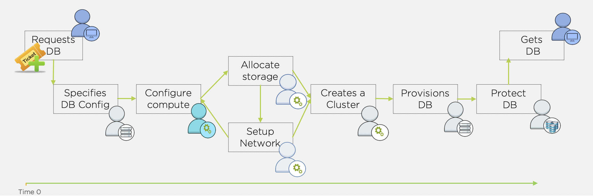

.. _configure_mssql:

---------------------------------------------------------
Configuring Your Microsoft SQL Server and Era Environment
---------------------------------------------------------

Traditional database VM deployment resembles the diagram below. The process generally starts with an IT ticket for a database (from Dev, Test, QA, Analytics, etc.). Next, one or more teams will need to deploy the storage resources and VM(s) required. Once infrastructure is ready, a DBA needs to provision and configure database software. Once provisioned, any best practices and data protection/backup policies need to be applied. Finally, the database can be handed over to the end user. That's a lot of handoffs, and the potential for a lot of friction.

Whereas with a Nutanix cluster and Era, provisioning and protecting a database should take you no longer than it took to read this intro.

Source Microsoft SQL Server VM
++++++++++++++++++++++++++++++

   .. note:: 
      
      Your `UserXX` designation is assigned by the SE leading the Bootcamp. Please do not proceed until this has been provided to you.

#. Open Chrome (preferred), and enter the IP address for your Prism Central instance

#. log in using the following credentials:
   
   - **Username** - admin
   - **Password** - <CLUSTER-PASSWORD> (provided by instructor)

  #. Within **Prism Central**, select :fa:`bars` **> Virtual Infrastructure > VMs**.

#. Right-click on your *UserXX*\ **-MSSQLSource** VM, and choose **Launch Console**. Log into the console using the following credentials:

   - **Username** - Administrator
   - **Password** - Nutanix/4u

#. Cancel *Shutdown Event Tracker* (if shown).

#. Open SQL Server Management Studio (SSMS) using the shortcut on the desktop. Choose **Windows Authentication** from the *Authentication* drop-down, and then click **Connect**.

#. Verify you can browse the *SampleDB* database.

Exploring Era Resources
+++++++++++++++++++++++

Era is distributed as a virtual appliance that can be installed on either AHV or ESXi. For the purposes of this workshop, a shared Era server has already been deployed on your cluster.

   .. note::

      If you're interested, instructions for the brief installation of the Era appliance can be found `here <https://portal.nutanix.com/page/documents/details?targetId=Nutanix-Era-User-Guide-v2_1:era-era-installation-c.html>`_. This includes instructions for both AHV and ESXi.

#. In **Prism Central**, select :fa:`bars` **> Virtual Infrastructure > VMs**. Choose **List** from the left-hand side.

#. Identify the IP address assigned to the *Era* VM using the *IP Addresses* column.

#. Open \https://`<ERA-VM-IP>`:8443/ in a new browser tab.

#. Login using the following credentials:

   - **Username** - admin
   - **Password** - `<CLUSTER-PASSWORD>`

#. From the drop-down menu, select **Administration**.

#. Select **Era Service** from the left-hand side. Note that Era has already been configured for your assigned cluster.

#. From the drop-down menu, select **SLAs**.

   Era has five built-in SLAs: Gold, Silver, Bronze, Brass, and None. SLAs control how the database server is backed up, or in the case of the *None* SLA, excluded from being backed up entirely. Backups can be configured with a combination of Continuous Protection, Daily, Weekly, Monthly, and Quarterly protection intervals.

#. From the drop-down menu, select **Profiles**.

   Profiles pre-define resources and configurations, making it simple to consistently provision environments and reduce configuration sprawl. For example, a *Compute* Profile specifies the size of the database server, including details such as vCPUs, cores per vCPU, and memory.

Registering Your Microsoft SQL Server VM
++++++++++++++++++++++++++++++++++++++++

Registering a database server with Era allows you to deploy databases to that resource, or use that resource as the basis for a Software Profile (Software Profiles will be expanded upon later in the workshop).

You must meet the following Era requirements before you register a SQL Server database with Era:

   - A local user account or a domain user account with administrator privileges on the database server must be provided.
   - Windows account or the SQL Server login account provided must be a member of sysadmin role.
   - SQL Server instance must be running.
   - Database files must not exist in boot (ex. C:\\) drive.
   - Database must be in an online state.
   - Windows remote management (WinRM) must be enabled

   .. note::

      Your *USERXX*\ **-MSSQLSource** VM already meets all of these criteria.

#. Within **Era**, select **Database Server VMs** from the drop-down menu, and then **List** from the left-hand menu.

   .. figure:: images/11.png

#. Click **+ Register > Microsoft SQL Server > Single Node Server VM** and fill out the following fields:

   - **IP Address or Name of VM** - *USERXX*\ **-MSSQLSource**
   - **Windows Administrator Name** - Administrator
   - **Windows Administrator Password** - Nutanix/4u
   - **Instance** - MSSQLSERVER (This should auto-populate after providing credentials)
   - **Connect to SQL Server Login** - Windows Admin User
   - **User Name** - Administrator

   .. note::

      If *MSSQLSERVER* doesn't automatically populate in the *Instance* field, this could indicate that the Windows Firewall in your *USERXX*\ **-MSSQLSource** VM may not have been disabled correctly.

   .. figure:: images/12.png

   .. note::

    You can click **API Equivalent** for many operations in Era to enter an interactive wizard providing JSON payload based data you've input or selected within the UI, and examples of the API call in multiple languages (cURL, Python, Golang, Javascript, and Powershell).

    .. figure:: images/17.png

#. Click **Register** to begin registering the Database Server.

#. Select **Operations** from the drop-down menu to monitor the registration. This process should take approximately 5 minutes.

   .. figure:: images/13.png

   .. note::

      It is also possible to register existing databases on any server, which will also register the database server it is on.

Creating A Software Profile
+++++++++++++++++++++++++++

Before additional SQL Server VMs can be provisioned, a Software Profile must first be created from the database server VM registered in the previous step. A software profile is a template that includes the SQL Server database software and the operating system. This template exists as a hidden, cloned disk image on your Nutanix storage.

#. Within **Era**, select **Profiles** from the drop-down menu, and then **Software** from the left-hand menu.

   .. figure:: images/14.png

#. Click **+ Create > Microsoft SQL Server** and fill out the following fields:

   - **Profile Name** - *USERXX*\ **_MSSQL_2016**
   - **Profile Description** - (Optional)
   - **Software Profile Version Name** - *USERXX*\ **_MSSQL_2016 (1.0)**
   - **Software Profile Version Description** – (Optional)
   - **Database Server VM** - Select your registered *USERXX*\ **-MSSQLSource** VM

   .. figure:: images/15.png

#. Click **Next** and fill out the following fields:

   - **Operating System Notes** - (Optional)
   - **Database Software Notes** - (Optional)

#. Click **Create**.

#. Select **Operations** from the drop-down menu to monitor the registration. This process should take approximately 2 minutes.

   .. figure:: images/16.png

   .. note::

       If creating a profile from a server not gracefully shut down, it may be corrupt or may not provision successfully. Please ensure that *USERXX*\ **-MSSQLSource** had a clean shutdown, and clean startup before registering profile to Era.
