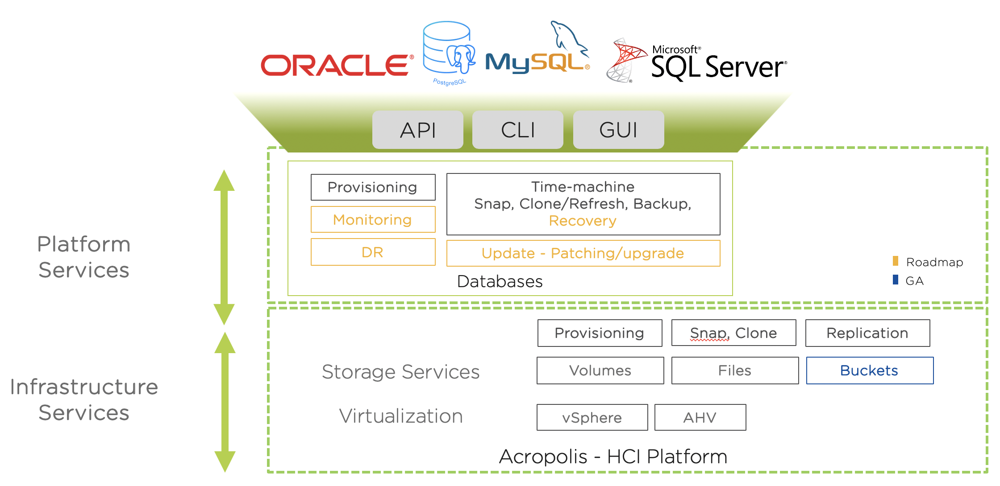

.. title:: Databases: Era With MSSQL

.. toctree::
   :maxdepth: 2
   :caption: Era Lab Setup
   :name: _dbs
   :hidden:

..   labsetup/labsetup

.. toctree::
   :maxdepth: 2
   :caption: Era with MSSQL
   :name: _dbs
   :hidden:

   configure_mssql/configure_mssql
   admin_mssqldb/admin_mssqldb
   deploy_mssql_era/deploy_mssql_era
   patch_sql/patch_sql

.. toctree::
  :maxdepth: 2
  :caption: Optional Labs
  :name: _optional_labs
  :hidden:

  webtier/webtier
  prismops_appmonitoring_lab/prismops_appmonitoring_lab
  era_rest_api/era_rest_api

.. toctree::
  :maxdepth: 2
  :caption: Appendix
  :name: _appendix
  :hidden:

  appendix/glossary
..  tools_vms/windows_tools_vm
..  tools_vms/linux_tools_vm

.. _getting_started:

---------------
Getting Started
---------------

Welcome to the Databases: Era with MSSQL bootcamp. This bootcamp is meant to provide you with first-hand experience to illustrate why Nutanix is an ideal platform for Database workloads.

Historically, it has been a challenge to virtualize SQL Server because of the high cost of traditional virtualization stacks and the impact that a SAN-based architecture can have on performance. Businesses and their IT departments have constantly fought to balance cost, operational simplicity, and consistent predictable performance.

The Nutanix Enterprise Cloud removes many of these challenges and makes virtualizing a business-critical application such as SQL Server much easier. The Acropolis Distributed Storage Fabric (DSF) is a software-defined solution that provides all the features one typically expects in an enterprise SAN, without a SAN’s physical limitations and bottlenecks. SQL Server particularly benefits from the following DSF features:

- Localized I/O and the use of flash for index and key database files to lower operation latency.
- A highly distributed approach that can handle both random and sequential workloads.
- The ability to add new nodes and scale the infrastructure without system downtime or performance impact.
- Nutanix data protection and disaster recovery workflows that simplify backup operations and business continuity processes.

In addition to solving common infrastructure problems for hosting business critical applications, Nutanix also seeks to address many of the key pain points associated with managing databases.

.. figure:: images/4.png

Based on a 2018 IDC study of 500 North American companies with more than 1,000 employees, they estimate:

- 77% of the organizations have more than 200 database instances in production
- 82% have more than 10 copies of each database
- 45%-60% the total storage capacity is dedicated to accommodating copy data
- 32% of database clones require daily refreshes for analytics or dev/test
- Copy data will cost IT organizations $55.63 billion in 2020

Maintaining the status quo leads to inefficient usage of both storage and worse, of administrator time. Meet Nutanix Era.

Nutanix Era provides DBaaS for your Enterprise Cloud. Leveraging the Nutanix Enterprise Cloud OS, we can take advantage of the power of the full stack - data, compute, and software. Nutanix Era hides the complexity of database operations and provides a common API, CLI, and consumer-grade GUI experience for multiple database engines. It makes database operations such as cloning efficient, thereby driving down the TCO of database management for our customers.

What's New
++++++++++

- Workshop updated for the following software versions:
    - AOS 5.20
    - Prism Central 2021.3.0.1
    - Era 2.1.1.2

Agenda
++++++

- Introductions
- Configuring Your Microsoft SQL Server and Era Environment
- DB Administration with Era
- Deploying Microsoft SQL with Era
- Patching Microsoft SQL

Optional labs:

-	Deploying the Web tier
-	Application monitoring with Prism Ultimate

Introductions
+++++++++++++

- Name
- Familiarity with Nutanix?

Initial Setup
+++++++++++++

- Take note of the *Passwords* being used.
- Log into your virtual desktops (connection info below).

Environment Details
+++++++++++++++++++

Nutanix Workshops are intended to be run in the Nutanix Hosted POC environment. Your cluster will be provisioned with all necessary images, networks, and VMs required to complete the exercises.

Each cluster has a dedicated domain controller VM (*AutoAD*) responsible for providing Microsoft Active Directory services for the **NTNXLAB.local** domain. The domain is populated with the following users and groups:

.. list-table::
   :widths: 25 35 40
   :header-rows: 1

   * - Group
     - Username(s)
     - Password
   * - Administrators
     - Administrator
     - nutanix/4u
   * - SSP Admins
     - adminuser01-adminuser25
     - nutanix/4u
   * - SSP Developers
     - devuser01-devuser25
     - nutanix/4u
   * - SSP Consumers
     - consumer01-consumer25
     - nutanix/4u
   * - SSP Operators
     - operator01-operator25
     - nutanix/4u
   * - SSP Custom
     - custom01-custom25
     - nutanix/4u
   * - Bootcamp Users
     - user01-user25
     - nutanix/4u

Access Instructions
+++++++++++++++++++

The Nutanix Hosted POC environment can be accessed a number of different ways:

Lab Access User Credentials
...........................

PHX Based Clusters:
**Username:** PHX-POCxxx-User01 (up to PHX-POCxxx-User20), **Password:** *<Provided by Instructor>*

RTP Based Clusters:
**Username:** RTP-POCxxx-User01 (up to RTP-POCxxx-User20), **Password:** *<Provided by Instructor>*

Frame VDI
.........

Login to: https://console.nutanix.com/x/labs

**Nutanix Employees** - Use your **NUTANIXDC** credentials
**Non-Employees** - Use **Lab Access User** Credentials

Parallels VDI
.................

PHX Based Clusters Login to: https://xld-uswest1.nutanix.com

RTP Based Clusters Login to: https://xld-useast1.nutanix.com

**Nutanix Employees** - Use your **NUTANIXDC** credentials
**Non-Employees** - Use **Lab Access User** Credentials

Employee Pulse Secure VPN
..........................

Download the client:

PHX Based Clusters Login to: https://xld-uswest1.nutanix.com

RTP Based Clusters Login to: https://xld-useast1.nutanix.com

**Nutanix Employees** - Use your **NUTANIXDC** credentials
**Non-Employees** - Use **Lab Access User** Credentials

Install the client.

In Pulse Secure Client, **Add** a connection:

For PHX:

- **Type** - Policy Secure (UAC) or Connection Server
- **Name** - X-Labs - PHX
- **Server URL** - xlv-uswest1.nutanix.com

For RTP:

- **Type** - Policy Secure (UAC) or Connection Server
- **Name** - X-Labs - RTP
- **Server URL** - xlv-useast1.nutanix.com

Nutanix Version Info
++++++++++++++++++++

- **AHV Version** - AHV 20170830.337 (AOS 5.11+)
- **AOS Version** - 5.17.x | 5.18.x | 5.19.x
- **PC Version** - Prism 2020.11
